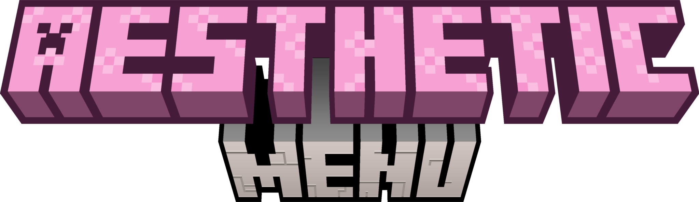

 

# TODO List:

- [x] Creating GUI menus in json config
- [ ] Plugin API
- [x] Creating menus with Chest and Player inventory
- [x] Add bStats statistic
- [x] PlaceholderAPI support
- [ ] Animations
- [x] Open requirements
- [x] Click requirements
- [ ] Ingame menu creating
- [ ] Connect different servers via BungeeCord/Velocity
- [x] Different click actions
- [x] Reload command
- [x] Optional parameters
- [x] Custom heads
- [ ] Register short commands
- [ ] Different gui types (chest, anvil, dropper, hopper and etc.)

